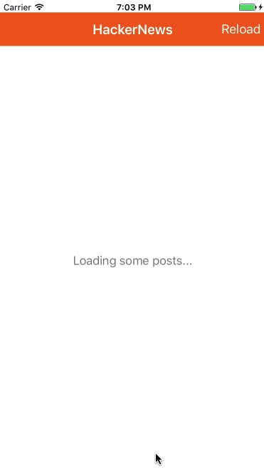

# HackerNews Client

This example implements a simple HackerNews client that loads the front page of the site, by connecting to the [HN Search API](https://hn.algolia.com/api).

As a toy example, this app is far from complete. It could be **improved** by:

- Loading and displaying comments
- Fetching more stories when reaching the end of the list of posts

Feel free to open a [pull request](https://github.com/BendingSpoons/katana-swift/pulls) for improvements! We'd love that.

### What is showcased here:

- Most of the basics of Katana
- Custom Nodes wrapping UIKit views as `WKWebView` and `UIActivityIndicatorView`
- Tables
- Async Actions: Actions that are executed without blocking the application
- Providers: components that can be used to provide some functionality during side effects.