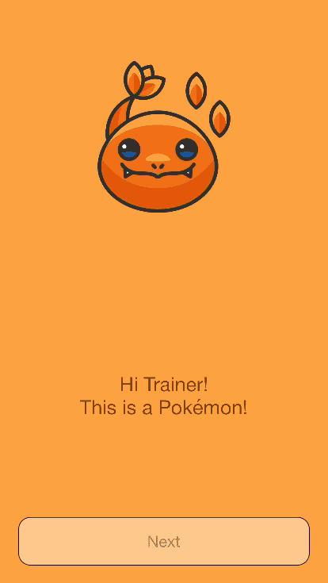

#PokeAnimations
This example shows a potential onboard for a mobile game. We loop between slides and we animate content that appear or disappear in each slide.
Here is the final result.



###What is showcased here:

The main purpose of this example is to show the Katana animation system. Look at the `updateChildrenAnimations` to understand how you can animate elements of your UI.

## How animations work
### Show me the code
Before digging into the theory of the animations, let's take a look to how you can use them.
The only thing we need to know here is that a transition from an UI state A to another UI state B can involve insertion or remotion of UI elements. We refer to the formers as `leave elements` and to the latters as `entry elements`. This is because elements leave and entry in the UI.

This is the method you need to implement to define the animation logic
```swift
  static func updateChildrenAnimations(container: inout ChildrenAnimations<Keys>,
                                       currentProps: PropsType,
                                       nextProps: PropsType,
                                       currentState: StateType,
                                       nextState: StateType) {
// your logic here
}
```
Based on the current props and state and to the next ones, you can define which animations you want. If you don't update the `container`, there won't be any animation.

You can assign an animation to each element in the following way
```swift
container[key] = Animation(
	type: type,
	entryTransformers: entryTransformers,
	entryTransformers: leaveTransformers
)
```
The `type` is the animation type (linear or sprint) and you can also define parameters such as the duration.

What about  `entryTransformers` and `entryTransformers`? 
The `entryTransformers` are a list of functions that are applied to the elements that are about to enter in the UI, just before we perform the animation. The result is that we will see an animation from the UI state defined by the props transformed, to the final state (which is represented by the props you returned in the `childrenDescriptions` method).
The `leaveTransformers` is the same, but for elements that are about to leave the UI.

You can use built in transformers (like we do in the example) or create your own. A transformer is simply a function with the following signature:
```swift
(_ props: AnyNodeDescriptionProps) -> AnyNodeDescriptionProps
```

### Animation Theory
Let's say we want to animate from a UI state A (current state) to a UI state B (a new state).
We move to  B either because the properties are changed or the state is changed.

UIKit provides powerful methods to animate changes in the UI. In particular, we can leverage the `UIView.animate`.
But what happens when B contains new elements? Or it doesn't contains elements that were in A? Katana will create or destroy these pieces of UI, but this can't be managed by UIKit.

In order to address this problem we introduced a 4 step animation:
- The first step is the current UI state: A
- We render an intermediate step. This step is basically identical to A but we also create all the elements there are in B but not in A. We then apply to them the proper `entryTransformers` if available. The transition from A to this first intermediate step is not animated
- We render a second intermediate step. This is basically identical to B but we keep al the elements that were in B even if they are no more present in B. To each element that is in A but not in B, we apply the `leaveTransformers` if available. The transition between the two intermediate steps is animated using the animations specified in the `updateChildrenAnimations` method
- We render B. The transition is not animated

By using this approach we are able to animate creation and deletion of UI elements gracefully. 