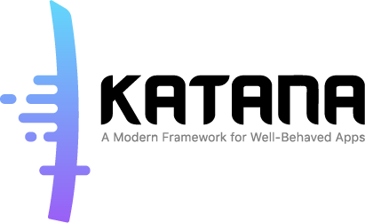

<p align="center">

</p>


Katana is a modern Swift framework for writing iOS apps, strongly inspired by [React](https://facebook.github.io/react/) and [Redux](https://github.com/reactjs/redux), that gives structure to all the aspects of your app:

- __logic__: the app state is entirely described by a single serializable data structure and the only way to change the state is to dispatch an action. An action is an intent to transform the state and contains all the informations to do so. Because all the changes are centralized and are happening in a strict order, there are no subtle race conditions to watch out for.
- __UI__: you define the UI in terms of a tree of components declaratively described by props (the configuration data, i.e. a background color for a button) and state (the internal state data, i.e. the highlighted state for a button). This approach lets you think about components as an isolated, reusable piece of UI, since the way a component is rendered only depends on the current props and state of the component itself.
- __logic__ ↔️ __UI__: your UI components are attached to the store and will be automatically updated on every state change. You control how they change, connecting the app state to the component props.
- __layout__: Katana defines a concise language (inspired by [Plastic](https://github.com/BendingSpoons/plastic-lib-iOS)) to describe fully responsive layouts that will gracefully scale at every aspect ratio or size, including font sizes and images.


We feel that Katana helped us a lot since we started using it in production for more than X apps with XXXX active users per day. At Bending Spoons we use a lot of open source projects ourselves and we wanted to give something back to the community, hoping you will find this useful and possibly contribute. ❤️ 


|                     | Katana                                   |
| ------------------- | ---------------------------------------- |
| :studio_microphone: | Declaratively define your UI             |
| :package:           | Store all your app state in a single place |
| :guardsman:         | Clearly define what are the actions that can change the state |
| :bowtie:            | Describe asynchronous actions like HTTP requests |
| :muscle:            | Use support for middleware like Logging  |
| :tophat:            | Automatically update the UI when your app state changes |
| :triangular_ruler:  | Automatically scale your UI to every size and aspect ratio |
| :horse_racing:      | Animate all the UI changes               |


## Overview

### Defining the logic of your app

your entire app `State` is defined in a single struct, all the relevant application information should be placed here.

```swift
struct CounterState: State {
  var counter: Int = 0
}
```

The app state can only be modified by an `Action`. An action represents an event that leads to a change in the state of the app. You define the behaviour of the action implementing the `updatedState()` method that will return the new app state based on the current app state and the action itself.

```swift
struct IncrementCounter: Action {
  static func updatedState(currentState: State, action: IncrementCounter) -> State {
    guard var state = currentState as? CounterState else { fatalError("wrong state type") 	  }
    state.counter += 1
    return state
  }
}
```

The `Store` contains and manages your entire app state and it is responsible for dispatching actions and updating the state

```swift
let store = Store<CounterState>()
store.dispatch(IncrementCounter())
```

you can ask the `Store` to be notified about every change in the app state

```swift
store.addListener() {
  // the app state has changed
}
```


### Defining the UI

In Katana you declaratively describe a specific piece of UI providing a  `NodeDescription`. Each `NodeDescription` will define the component in terms of:

- `StateType` the internal state of the component (es. highlighted for a button)
- `PropsType` the inputs coming from outside the component (es. backgroundColor for a view)
- `NativeView` the UIKit element associated with the component

```swift
struct CounterScreen: NodeDescription {
	typealias StateType = EmptyState
	typealias PropsType = CounterScreenProps
	typealias NativeView = UIView
	
	var props: PropsType
}
```

Inside the `props` you want to specify all the inputs needed to render your `NativeView` and to feed your children components

```swift
struct CounterScreenProps: NodeDescriptionProps {
  var count: Int = 0
  var frame: CGRect = .zero
  var alpha: CGFloat = 1.0
  var key: String?
}
```

When it's time to render the component, the method `applyPropsToNativeView` is called: this is where we need to adjust our nativeView to reflect the  `props` and the `state`. _Note that for common properties like frame, backgroundColor and more we already provide a standard [applyPropsToNativeView](/KatanaElements/View.swift) so we got you covered._

```swift
struct CounterScreen: NodeDescription {
  ...
  public static func applyPropsToNativeView(props: PropsType,
  											state: StateType,
  											view: NativeView, ...) {
  	view.frame = props.frame
  	view.alpha = props.alpha
  }
}
```

`NodeDescriptions` lets you split the UI into small independent, reusable pieces. That's why it is very common for a `NodeDescription` to be composed by others `NodeDescription` as children, generating the UI tree. To define child components implement the method `childrenDescriptions`

```swift
struct CounterScreen: NodeDescription {
  ...
  public static func childrenDescriptions(props: PropsType,
  											state: StateType, ...) -> 	  [AnyNodeDescription] {
  	return [
  		Label(props: LabelProps.build({ (labelProps) in
          labelProps.key = CounterScreen.Keys.label.rawValue
          labelProps.textAlignment = .center
          labelProps.backgroundColor = .mediumAquamarine
          labelProps.text = NSAttributedString(string: "Count: \(props.count)", attributes: nil)
      })),
      Button(props: ButtonProps.build({ (buttonProps) in
        buttonProps.key = CounterScreen.Keys.decrementButton.rawValue
        buttonProps.titles[.normal] = "Decrement"
        buttonProps.backgroundColor = .dogwoodRose
        buttonProps.titleColors = [.highlighted : .red]
        
        buttonProps.touchHandlers = [
          .touchUpInside : {
            dispatch(DecrementCounter())
          }
        ]
      })),
      Button(props: ButtonProps.build({ (buttonProps) in
        buttonProps.key = CounterScreen.Keys.incrementButton.rawValue
        buttonProps.titles[.normal] = "Increment"
        buttonProps.backgroundColor = .japaneseIndigo
        buttonProps.titleColors = [.highlighted : .red]
        
        buttonProps.touchHandlers = [
          .touchUpInside : {
            dispatch(IncrementCounter())
          }
        ]
      }))
  	]
  }
}
```


### Attaching the UI to the Logic

The `Renderer` is responsible for rendering the UI tree and updating it when the `Store` changes. 

You create a Renderer object starting from the top level NodeDescription and the store.

```
renderer = Renderer(rootDescription: counterScreen, store: store)
renderer.render(in: view)
```

Every time a new app state is available, the store dispatches an event that is captured by the Renderer and dispatched down to the tree of UI components.
If you want a node to receive updates from the `Store` just declare its `NodeDescription` as `ConnectedNodeDescription` and implement the method `connect` to attach the app `Store` to the component `props`

```
struct CounterScreen: ConnectedNodeDescription {
  ...
  static func connect(props: inout PropsType, to storeState: StateType) {
  	props.count = storeState.counter
  }
}
```


### Layout of the UI

Katana has its own language (inspired by [Plastic](https://github.com/BendingSpoons/plastic-lib-iOS)) to programmatically define fully responsive layouts that will gracefully scale at every aspect ratio or size, including font sizes and images.
If you want to opt in, just implement the `PlasticNodeDescription` protocol and its `layout` method where you can to define the layout of the children, based on the given `referenceSize`. The layout system will use the reference size to compute the proper scaling. 

```swift
struct CounterScreen: ConnectedNodeDescription, PlasticNodeDescription, PlasticReferenceSizeable {
  ...
  static var referenceSize = CGSize(width: 640, height: 960)
  
  static func layout(views: ViewsContainer<CounterScreen.Keys>, props: PropsType, state: StateType) {
    let nativeView = views.nativeView
    
    let label = views[.label]!
    let decrementButton = views[.decrementButton]!
    let incrementButton = views[.incrementButton]!
    label.asHeader(nativeView)
    [label, decrementButton].fill(top: nativeView.top, bottom: nativeView.bottom)
    incrementButton.top = decrementButton.top
    incrementButton.bottom = decrementButton.bottom
    [decrementButton, incrementButton].fill(left: nativeView.left, right: nativeView.right)
  }
}
```


#### You can find the complete example [here](insert link to the complete example)


## Where to go from here

### Explore sample projects

[insert here list of sample projects]

### Check out the documentation

[insert here link to the documentation]


## Installation

Katana is available through [CocoaPods](https://cocoapods.org/) and [Carthage](insert link here), you can also drop `Katana.project` into your XCode project.

### Requirements

- iOS 8.4+

- Xcode 8.0+

- Swift 3.0+

  ​

### CocoaPods

 [CocoaPods](https://cocoapods.org/) is a dependency manager for Cocoa projects. You can install it with the following command:

```bash
$ sudo gem install cocoapods
```

To integrate Katana into your XCode project using CocoaPods, add it to your `Podfile`:

```
use_frameworks!
source [include project source here]
platform :ios, '8.4'

pod 'KatanaSwift'
```

And run:

```bash
$ pod install
```


### Carthage

[Carthage](https://github.com/Carthage/Carthage) is a decentralized dependency manager for Cocoa projects. 
You can install Carthage downloading and running the `Carthage.pkg` file you can download from [here](https://github.com/Carthage/Carthage/releases) or you can install it using [Homebrew](http://brew.sh/) simply by running:

```bash
$ brew update
$ brew install carthage
```

To integrate Katana into your XCode project using Carthage, add it to your `Cartfile`:

```
github "Bendingspoons/KatanaSwift"
```

And Run:

```bash
$ carthage update
```

Then drag the built `Katana.framework` into your XCode project


## Roadmap

- [x] Immutable state


- [x] unidirectional data flow


- [x] sync/async/sideEffect actions
- [x] middlewares
- [x] automatic UI update
- [x] native redux-like implementation
- [x] native react-like implementation
- [x] declarative UI
- [x] leverage Plastic layout engine
- [ ] support other layout engines
- [ ] Declarative Table element
- [ ] macOS support
- [ ] improve test coverage
- [ ] expand documentation


## Communication

- if you have __any questions__ you can find us on twitter: @handle, @handle, @handle, ...


## Contribute

- If you've __found a bug__, open an issue
- If you have a __feature request__, open an issue
- If you __want to contribute__, submit a pull request

## License

Katana is available under the [MIT license](insert link to LICENSE file here)
